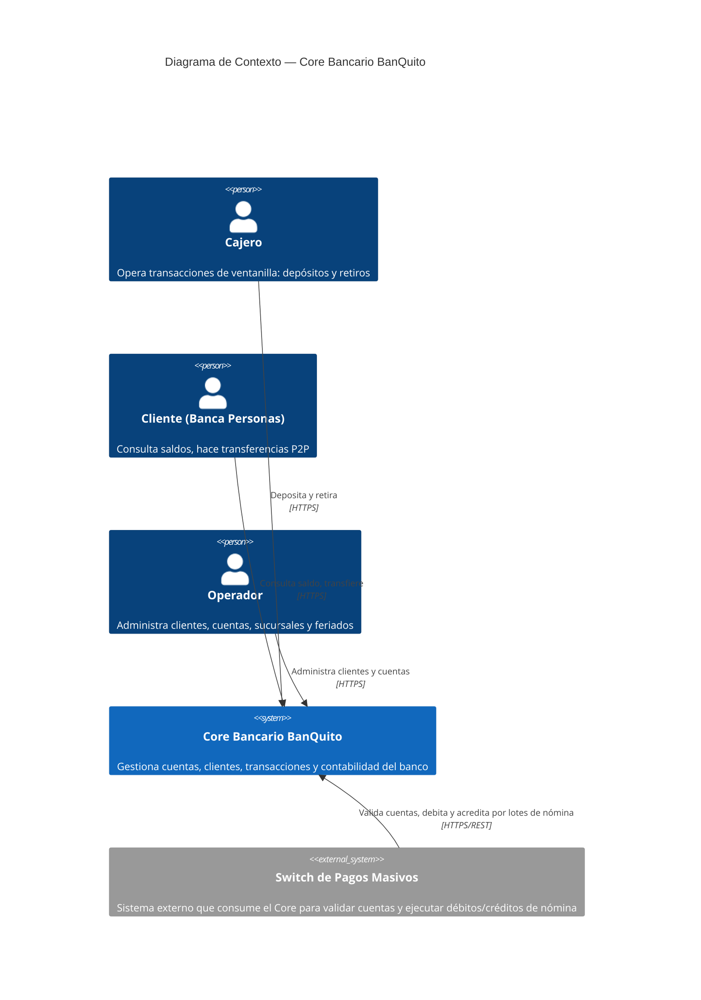

# Core Bancario BanQuito — C1 (Contexto)

## Lectura del diagrama

- **Cajero**, **Cliente (Banca Personas)** y **Operador** son los tres roles humanos que interactúan directamente con el Core.
- El Core es un sistema **pasivo**: no inicia comunicación hacia el Switch, solo responde a sus solicitudes (ver ADR 001 y ADR 011 de este repositorio).
- El **Switch de Pagos Masivos** es el único sistema externo relevante: valida cuentas y ejecuta movimientos de nómina masiva contra el Core, pero el Core no conoce ni depende de su lógica interna.
