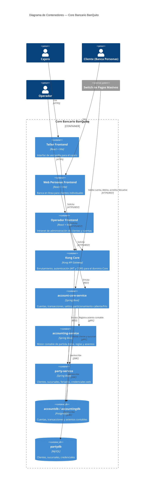

# Core Bancario BanQuito — C2 (Contenedores)

## Lectura del diagrama

- **Colores por rol** (convención C4): interfaces de usuario (teal), lógica de negocio (morado), datos (ámbar), externos (coral) — no se muestran clases de color explícitas porque el renderer de GitHub usa su propia paleta por defecto para `C4Container`.
- `account-core-service` es el corazón del dominio: habla por **gRPC** con `accounting-service` (para contabilizar cada movimiento) y con `party-service` (para validar el cliente dueño de la cuenta).
- `operador-frontend` también se conecta al Switch (`clearinghouse-service`) para la sección de Banco Central, pero esa relación se documenta en el diagrama del Switch para no mezclar dominios en este C2.
- `Kong Core` es el único punto de entrada público hacia los tres microservicios del dominio Core.
