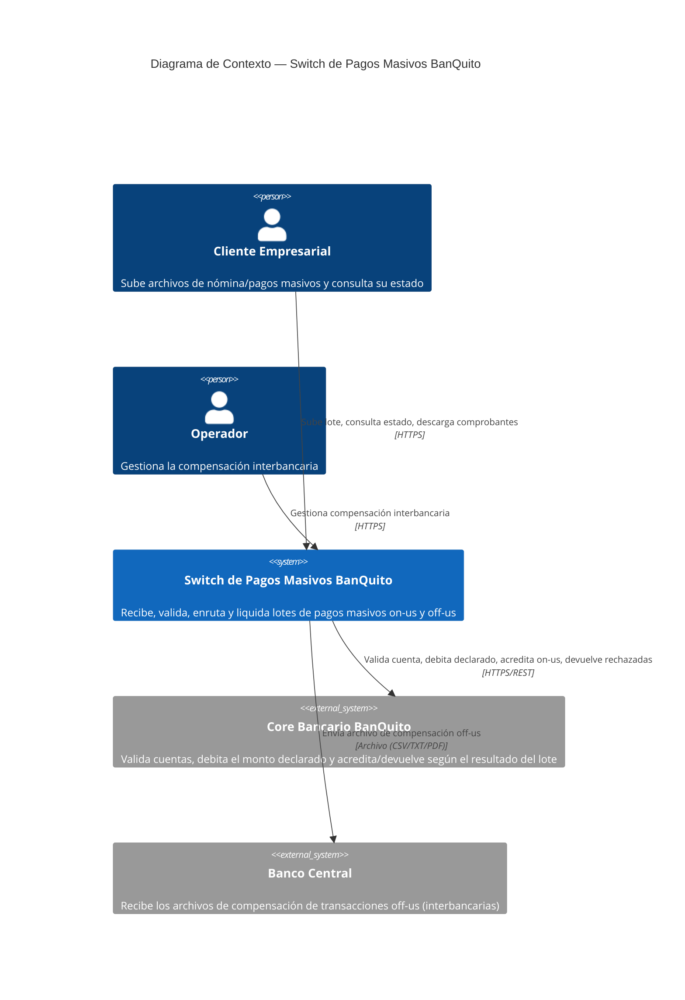

# Switch de Pagos Masivos BanQuito — C1 (Contexto)

## Lectura del diagrama

- El **Cliente Empresarial** es quien opera el flujo de negocio principal: sube el archivo, consulta el avance y descarga comprobantes.
- El Switch **orquesta** al Core Bancario (lo consume, nunca al revés — ver ADR 011), a diferencia de una arquitectura donde el routing lo haría un microservicio propio: aquí ese enrutamiento lo resuelve RabbitMQ internamente (ver C2).
- **Banco Central** es el sistema externo con el que se liquidan las transacciones off-us (cuentas de otros bancos).
