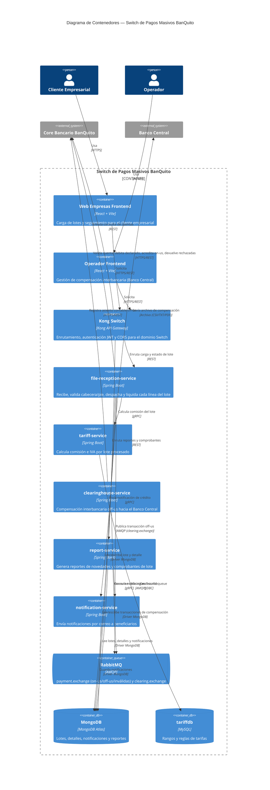

# Switch de Pagos Masivos BanQuito — C2 (Contenedores)

## Lectura del diagrama

- El **enrutamiento on-us/off-us/inválidas** no lo hace un microservicio propio: lo resuelve `payment.exchange` de **RabbitMQ** mediante *routing keys*, y `file-reception-service` es quien publica y consume esas colas (ver ADR 011 — eliminación de routing-service).
- `file-reception-service` es el contenedor con más responsabilidad: valida el lote, debita el monto **declarado** en cabecera/pie al aceptar el archivo, procesa cada línea, y al completar el lote devuelve el monto de las líneas **rechazadas** como un movimiento independiente del cobro de comisión.
- `clearinghouse-service` es quien realmente "sale" del banco: solo él habla con el **Banco Central** (vía archivo) y solo él consume la cola de compensación off-us.
- `tariff-service` y `notification-service` se comunican por **gRPC** (RPC binario de baja latencia), mientras que la integración con el Core y el Banco Central es por **REST/archivo** — refleja que son límites de sistema distintos.
