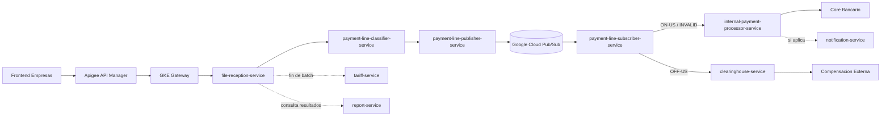

# Anexo R - Separacion del flujo Pub/Sub del Switch

## Objetivo

Separar las responsabilidades del procesamiento de pagos masivos para que `file-reception-service` no concentre recepcion, clasificacion, salida a Pub/Sub y consumo de mensajes.

La arquitectura objetivo queda asi:

```text
file-reception-service
  -> recibe archivo
  -> valida estructura
  -> registra lote

payment-line-classifier-service
  -> toma las lineas del lote validado
  -> etiqueta cada linea:
       ON-US
       OFF-US
       INVALID

payment-line-publisher-service
  -> toma lineas etiquetadas
  -> publica en Pub/Sub con atributos de ruteo

Pub/Sub
  -> enruta mensajes usando filtros de atributos

payment-line-subscriber-service
  -> consume los mensajes publicados
  -> no ejecuta reglas de pago
  -> delega segun clasificacion:
       internal-payment-processor-service
       clearinghouse-service
```

## Por que Pub/Sub no clasifica

Pub/Sub no entiende reglas bancarias. Pub/Sub solo recibe mensajes, los almacena temporalmente y los entrega a subscribers.

La clasificacion ON-US, OFF-US o INVALID debe hacerla un microservicio porque depende de reglas de negocio:

| Clasificacion | Regla de negocio |
| --- | --- |
| ON-US | La cuenta destino pertenece al Core BanQuito. |
| OFF-US | La cuenta destino pertenece a otra institucion financiera. |
| INVALID / INVALID_ROUTING | La linea no puede enrutarse por falta de codigo de ruta, codigo inexistente, formato invalido o banco destino no reconocido. |

Pub/Sub si puede usar filtros por atributos, pero esos atributos ya deben venir calculados por la aplicacion:

```text
attributes.routingKey = "onus"
attributes.routingKey = "offus"
attributes.routingKey = "invalid"
```

## Diferencia entre invalid de ruteo e invalid de procesamiento

Es importante no mezclar dos tipos de rechazo.

El clasificador solo debe marcar invalidos cuando la linea no puede ser enrutada. Ese caso se puede llamar conceptualmente `INVALID_ROUTING`.

Ejemplos que si pertenecen al clasificador:

| Caso | Motivo |
| --- | --- |
| Codigo de ruta vacio | No se puede saber si la linea es ON-US u OFF-US. |
| Codigo de ruta inexistente | No existe banco o ruta asociada. |
| Banco destino no reconocido | No hay institucion destino valida. |
| Formato minimo invalido | La linea no cumple lo necesario para ser ruteada. |

El clasificador no debe validar si una cuenta existe, si esta activa o si puede recibir dinero. Eso ya requiere consultar dominios de negocio.

Ejemplos que no pertenecen al clasificador:

| Caso | Responsable |
| --- | --- |
| Cuenta destino no existe en Core | `internal-payment-processor-service` consultando al Core. |
| Cuenta destino esta inactiva o bloqueada | `internal-payment-processor-service` consultando al Core. |
| Cuenta destino no permite transferencias | `internal-payment-processor-service` consultando al Core. |
| Beneficiario no coincide | `internal-payment-processor-service` o `clearinghouse-service`, segun sea ON-US u OFF-US. |
| Banco externo rechaza la compensacion | `clearinghouse-service`. |

Regla de defensa:

```text
El clasificador no dice si la cuenta puede recibir dinero.
El clasificador solo dice por donde debe viajar la linea.
Si no puede decidir la ruta, marca INVALID_ROUTING.
Las validaciones bancarias reales se hacen despues, en internal-payment-processor-service o clearinghouse-service.
```

## Servicios objetivo

| Servicio | Rol |
| --- | --- |
| `file-reception-service` | Recibe archivo, valida estructura, valida datos del lote y registra lote/lineas. |
| `payment-line-classifier-service` | Lee lineas del lote y solo coloca la etiqueta de clasificacion: `ON-US`, `OFF-US` o `INVALID`. |
| `payment-line-publisher-service` | Publica lineas etiquetadas en Google Cloud Pub/Sub usando atributos de ruteo. |
| Google Cloud Pub/Sub | Broker administrado. Enruta mensajes mediante subscriptions y filtros por atributos. |
| `payment-line-subscriber-service` | Unico consumidor de Pub/Sub. Recibe mensajes y delega segun clasificacion; no ejecuta reglas bancarias de pago. |
| `internal-payment-processor-service` | Procesa lineas `ON-US` e `INVALID`; no consume Pub/Sub directamente. Para `ON-US` envia al Core la instruccion transaccional. Para `INVALID` registra rechazo y actualiza resultado operativo. |
| `clearinghouse-service` | Procesa lineas `OFF-US`; no consume Pub/Sub directamente. Valida reglas de compensacion externa y ejecuta clearing. |
| `tariff-service` | Calcula/cobra la tarifa correspondiente cuando termina el batch. |
| `report-service` | Consulta avance y resultados del lote. |
| `notification-service` | Envia notificaciones cuando el flujo lo requiera; no pertenece al clearing. |

## Flujo detallado

```text
1. Web Empresas envia archivo a Apigee.
2. Apigee valida API Key y JWT.
3. Apigee enruta al Gateway de GKE.
4. Gateway envia la peticion a file-reception-service.
5. file-reception-service valida estructura, totales, duplicidad y registra el lote.
6. payment-line-classifier-service toma el lote validado.
7. payment-line-classifier-service etiqueta cada linea como ON-US, OFF-US o INVALID.
8. payment-line-publisher-service publica las lineas etiquetadas en Pub/Sub.
9. Pub/Sub enruta los mensajes por atributos.
10. payment-line-subscriber-service consume los mensajes publicados.
11. payment-line-subscriber-service delega ON-US hacia internal-payment-processor-service.
12. payment-line-subscriber-service delega INVALID hacia internal-payment-processor-service.
13. payment-line-subscriber-service delega OFF-US hacia clearinghouse-service.
14. internal-payment-processor-service valida ON-US/INVALID y solicita al Core Bancario la ejecucion de debito/credito cuando aplique.
15. clearinghouse-service valida OFF-US y ejecuta la compensacion externa.
16. tariff-service calcula/cobra la tarifa al final del batch.
17. report-service consulta el avance y resultados.
```

## Estado aplicado en codigo

Se implemento una primera separacion fisica del flujo:

| Componente | Estado aplicado |
| --- | --- |
| `banquito-payment-line-classifier-service` | Ya no publica a Pub/Sub desde el polling principal. Lee lotes `EN_PROCESO`, marca estado `CLASSIFYING`, guarda `routing_classification` por linea y termina en `CLASSIFIED`. |
| `banquito-payment-line-publisher-service` | Nuevo microservicio. Lee lotes `CLASSIFIED`, marca estado `PUBLISHING`, publica lineas en Pub/Sub con atributos y termina en `ROUTED`. |
| `banquito-infra/k8s/payment-line-publisher` | Nuevo Deployment y Service `ClusterIP` en namespace `banquito-switch`. |
| `banquito-infra/k8s/hpa/switch-hpa.yaml` | Nuevo HPA `payment-line-publisher-service-hpa`, minimo 1 y maximo 3 replicas. |
| `banquito-infra/k8s/configmap.yaml` | Agregados `PAYMENT_LINE_PUBLISHER_HOST` y `PAYMENT_LINE_PUBLISHER_PORT`. |
| `banquito-clearinghouse-service` | Agregado servidor gRPC `ClearingService` para recibir operaciones OFF-US desde el subscriber. |
| `banquito-payment-line-subscriber-service` | Agregado cliente gRPC hacia `clearinghouse-service`; OFF-US se delega por gRPC interno y el fallback Pub/Sub queda apagado por defecto. |

Campos persistidos por linea:

| Campo Mongo | Uso |
| --- | --- |
| `routing_classification` | Resultado de negocio: `ON_US`, `OFF_US` o `INVALID`. |
| `classification_status` | Estado de clasificacion de la linea. |
| `classified_at` | Fecha/hora en que la linea fue etiquetada. |

## Importante para no romper el sistema

La separacion fisica en Pods distintos requiere que el router reciba el lote validado por un mecanismo durable.

No basta con mover el listener a otro Deployment si el evento actual es un evento interno de Spring, porque:

```text
ApplicationEventPublisher solo funciona dentro del mismo proceso JVM.
Un evento interno de Spring no viaja de un Pod a otro.
```

Por eso, para separar completamente los servicios, hay que implementar uno de estos mecanismos:

| Opcion | Explicacion | Recomendacion |
| --- | --- | --- |
| Persistencia + polling controlado | `file-reception-service` guarda lote y lineas; router lee lotes pendientes. | Buena para este proyecto. |
| Endpoint interno | `file-reception-service` llama HTTP/gRPC interno al router. | Simple, pero acopla recepcion con router. |
| Evento durable de lote | `file-reception-service` publica solo un evento de lote validado. | Valido, pero contradice la decision actual de no publicar desde recepcion. |

La opcion aplicada es:

```text
file-reception-service guarda el lote validado en persistencia.
payment-line-classifier-service lee lotes pendientes y clasifica lineas.
payment-line-publisher-service lee lineas clasificadas y las entrega al broker administrado.
```

## Modo actual aplicado

En `file-reception-service`:

```text
APP_EMBEDDED_ROUTER_ENABLED=false
APP_DISPATCH_ENABLED=false
```

En `payment-line-classifier-service`:

```text
APP_EMBEDDED_ROUTER_ENABLED=false
APP_DISPATCH_ENABLED=false
APP_PAYMENT_LINE_CLASSIFIER_POLL_ENABLED=true
```

En `payment-line-publisher-service`:

```text
APP_EMBEDDED_ROUTER_ENABLED=false
APP_DISPATCH_ENABLED=false
APP_PAYMENT_LINE_CLASSIFIER_POLL_ENABLED=false
APP_PAYMENT_LINE_PUBLISHER_POLL_ENABLED=true
```

En `payment-line-subscriber-service`:

```text
APP_EMBEDDED_ROUTER_ENABLED=false
APP_DISPATCH_ENABLED=true
Consume Pub/Sub.
Delega ON-US a internal-payment-processor-service.
Delega INVALID a internal-payment-processor-service.
Delega OFF-US a clearinghouse-service.
```

## Separacion pendiente recomendada

El siguiente refinamiento es crear o exponer formalmente los servicios internos:

| Servicio | Responsabilidad pendiente |
| --- | --- |
| `internal-payment-processor-service` | Recibir instrucciones ON-US e INVALID desde `payment-line-subscriber-service`; validar la linea, llamar al Core Bancario cuando aplique y registrar el resultado. |
| `clearinghouse-service` | Recibir instrucciones OFF-US desde `payment-line-subscriber-service` por HTTP/gRPC interno, validar reglas de compensacion y procesar clearing sin consumir Pub/Sub directamente. |

Esta parte depende de definir el contrato interno entre subscriber, procesamiento interno y clearing.

En `internal-payment-processor-service`:

```text
No consume Pub/Sub.
Recibe instrucciones internas desde payment-line-subscriber-service.
Valida lineas ON-US e INVALID.
Para ON-US solicita al Core Bancario la ejecucion de debito/credito.
Para INVALID registra rechazo y actualiza avance del lote.
No modifica saldos directamente.
```

En `clearinghouse-service`:

```text
No consume Pub/Sub.
Recibe instrucciones internas desde payment-line-subscriber-service.
Valida lineas OFF-US.
Procesa compensacion OFF-US.
No envia notificaciones directamente.
```

## Bounded context de clearing

`clearinghouse-service` representa el limite entre BanQuito y el sistema financiero externo.

Su responsabilidad no es manejar cuentas internas ni saldos del Core. Su responsabilidad es recibir operaciones `OFF-US` ya identificadas y ejecutar el proceso de compensacion hacia una camara o banco externo.

Responsabilidades correctas del bounded context:

| Responsabilidad | Pertenece a `clearinghouse-service` |
| --- | --- |
| Validar que el banco destino externo exista o este soportado | Si |
| Validar formato minimo de la cuenta externa | Si |
| Construir mensaje de compensacion externa | Si |
| Conectarse a otro banco o camara de compensacion | Si |
| Manejar timeouts/reintentos contra externo | Si |
| Registrar respuesta aceptada/rechazada del externo | Si |
| Conciliar operaciones externas | Si |
| Validar saldo de cuenta origen BanQuito | No, corresponde al Core/procesamiento interno. |
| Modificar saldos de cuentas BanQuito | No, corresponde al Core Bancario. |
| Validar si una cuenta BanQuito existe | No, corresponde al Core Bancario. |

Flujo objetivo para pruebas con otro banco:

```text
payment-line-subscriber-service
  -> recibe mensaje OFF-US desde Pub/Sub
  -> llama por gRPC interno a clearinghouse-service

clearinghouse-service
  -> valida banco externo
  -> arma mensaje externo
  -> llama banco externo / camara de compensacion
  -> recibe respuesta
  -> registra resultado de clearing
  -> devuelve resultado al flujo del lote
```

Contrato interno aplicado:

```proto
service ClearingService {
  rpc RegisterOffUsPayment(OffUsPaymentRequest) returns (OffUsPaymentResponse);
}
```

Puerto interno:

```text
9094
```

Servicio Kubernetes:

```text
clearinghouse-service.banquito-switch.svc.cluster.local:9094
```

Estado aplicado:

```text
Servidor gRPC implementado en clearinghouse-service.
Cliente gRPC implementado en payment-line-subscriber-service.
APP_DISPATCH_OFFUS_ENABLED=true en payment-line-subscriber-service.
CLEARING_PUBSUB_LISTENER_ENABLED=false en clearinghouse-service.
CLEARINGHOUSE_DIRECT_DELEGATION_ENABLED=true.
CLEARING_PUBSUB_FALLBACK_ENABLED=false.
CLEARINGHOUSE_GRPC_HOST=clearinghouse-service.banquito-switch.svc.cluster.local.
CLEARINGHOUSE_GRPC_PORT=9094.
```

Payload conceptual:

```json
{
  "batchId": "uuid-del-lote",
  "lineNumber": 3,
  "sourceAccount": "1010114999",
  "destinationBankCode": "002",
  "destinationAccount": "2014146881",
  "beneficiaryName": "Beneficiario Externo",
  "amount": 422.65,
  "reference": "Pago masivo"
}
```

Respuesta conceptual:

```json
{
  "status": "ACCEPTED",
  "externalReference": "clearing-ref-123",
  "message": "Operacion enviada a compensacion"
}
```

Estados esperados:

| Estado | Significado |
| --- | --- |
| `ACCEPTED` | La operacion fue aceptada por el externo o la camara. |
| `REJECTED` | El externo rechazo la operacion. |
| `PENDING` | La operacion quedo pendiente de confirmacion. |
| `FAILED_RETRYABLE` | Fallo tecnico que puede reintentarse. |
| `FAILED_FINAL` | Fallo tecnico o funcional definitivo. |

Regla de defensa:

```text
Toda integracion con bancos externos o camara de compensacion se concentra en clearinghouse-service.
El Core no se conecta a bancos externos.
El subscriber no conoce protocolos externos.
El clearinghouse-service protege al resto del sistema de cambios en integraciones externas.
```

## Diagrama Mermaid para defensa



## Diagrama textual para defensa

```text
                   +----------------------+
                   |   Web Empresas       |
                   +----------+-----------+
                              |
                              v
                   +----------------------+
                   | Apigee API Manager   |
                   | API Key + OAuth2 JWT |
                   +----------+-----------+
                              |
                              v
                   +----------------------+
                   | GKE Gateway          |
                   +----------+-----------+
                              |
                              v
                   +----------------------+
                   | file-reception       |
                   | recibe y valida      |
                   +----------+-----------+
                              |
                              v
          +-------------------------------+
          | payment-line-classifier       |
          | etiqueta ON-US/OFF-US/INVALID |
          +---------------+---------------+
                          |
                          v
          +-------------------------------+
          | payment-line-publisher        |
          | publica mensajes etiquetados  |
          +---------------+---------------+
                          |
                          v
          +-------------------------------+
          | Google Cloud Pub/Sub          |
          | broker + filtros por atributo |
          +---------------+---------------+
                          |
                          v
          +-------------------------------+
          | payment-line-subscriber       |
          | consume y delega              |
          +-----------+-------------------+
                      |
          +-----------+-----------+
          |                       |
          v                       v
 +----------------------+  +----------------------+
 | internal-payment     |  | clearinghouse        |
 | ON-US / INVALID      |  | OFF-US validation    |
 +----------+-----------+  +----------+-----------+
            |                         |
            v                         v
 +----------------------+  +----------------------+
 | Core Bancario        |  | Compensacion externa |
 +----------------------+  +----------------------+
```

## Como explicarlo

Frase corta:

> Pub/Sub no clasifica archivos. La clasificacion es una regla de negocio y vive en `payment-line-classifier-service`. Pub/Sub hace el routing tecnico mediante filtros de atributos sobre mensajes ya etiquetados.

Frase para defensa:

> Se separo el Switch por responsabilidades claras dentro del bounded context de pagos masivos. `file-reception-service` queda como ingesta de archivos. `payment-line-classifier-service` solo etiqueta lineas. `payment-line-publisher-service` encapsula la salida hacia Pub/Sub. Pub/Sub actua como broker administrado y enruta por atributos. `payment-line-subscriber-service` encapsula el consumo del broker y delega: ON-US e INVALID al procesamiento interno, y OFF-US a clearing. Asi los servicios de negocio no dependen directamente de Pub/Sub y el Core Bancario mantiene la responsabilidad exclusiva sobre saldos y transacciones.


