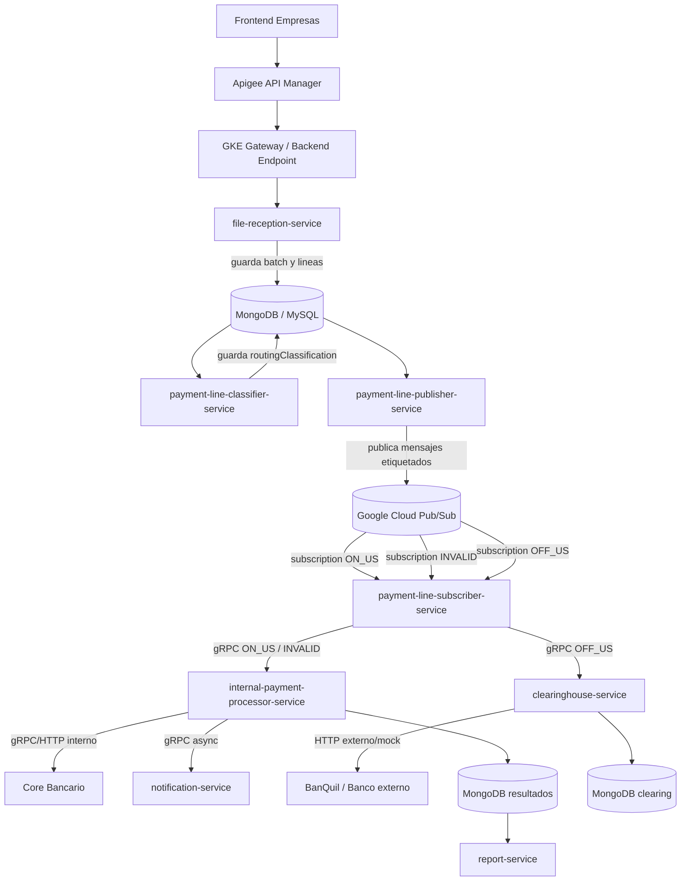
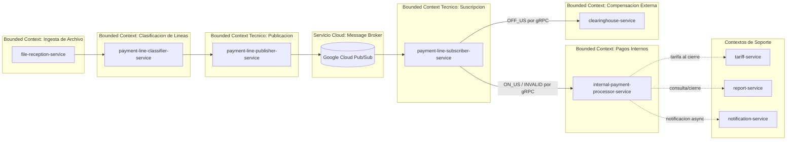
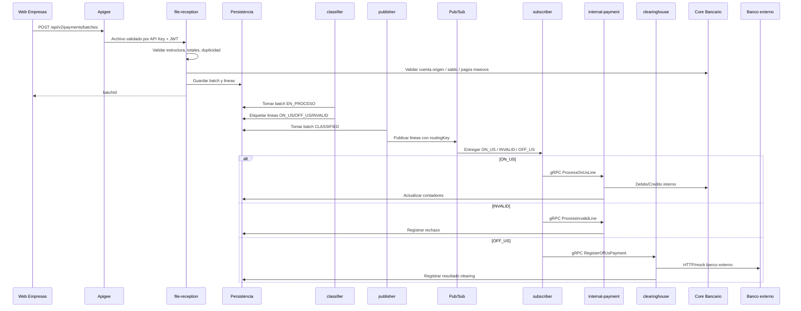

# Anexo W - Analisis de Bounded Context del Switch de Pagos

## Objetivo

Validar si los microservicios del Switch de Pagos Masivos cumplen una separacion correcta de responsabilidades segun bounded context.

La regla usada para evaluar es:

```text
Cada microservicio debe tener una responsabilidad principal, un lenguaje propio claro y un motivo independiente para cambiar.
```

## Resumen Ejecutivo

El Switch ya esta separado en varios componentes y la direccion arquitectonica es correcta. La separacion actual evita que `file-reception-service` haga todo el trabajo de recepcion, clasificacion, publicacion, consumo y procesamiento.

El flujo objetivo queda asi:

```text
file-reception-service
  -> payment-line-classifier-service
  -> payment-line-publisher-service
  -> Google Cloud Pub/Sub
  -> payment-line-subscriber-service
  -> internal-payment-processor-service / clearinghouse-service
```

La principal brecha tecnica detectada es que `payment-line-subscriber-service` todavia conserva logica de procesamiento financiero local para OFF-US si se habilita `APP_DISPATCH_OFFUS_ENABLED=true`. Para una arquitectura mas limpia, el subscriber deberia limitarse a consumir Pub/Sub y delegar por gRPC.

## Microservicios del Switch

| Microservicio | Responsabilidad Principal | Bounded Context | Veredicto |
| --- | --- | --- | --- |
| `file-reception-service` | Recibir archivo, validar estructura, validar lote, registrar batch y lineas. | Ingesta de archivos de pagos masivos. | Correcto. |
| `payment-line-classifier-service` | Leer lineas pendientes y etiquetarlas como `ON_US`, `OFF_US` o `INVALID`. | Clasificacion de lineas de pago. | Correcto. |
| `payment-line-publisher-service` | Publicar lineas clasificadas en Pub/Sub con atributos de ruteo. | Publicacion tecnica hacia broker. | Correcto. |
| Google Cloud Pub/Sub | Broker administrado; entrega mensajes mediante subscriptions/filtros. | Infraestructura cloud, no dominio de negocio. | Correcto. |
| `payment-line-subscriber-service` | Consumir mensajes de Pub/Sub y delegar por gRPC. | Adaptador de entrada asincrona. | Parcial. Tiene restos de procesamiento local. |
| `internal-payment-processor-service` | Procesar lineas internas `ON_US` e `INVALID`, llamar al Core, actualizar resultados y notificar en segundo plano. | Procesamiento financiero interno del batch. | Correcto, con una observacion de nombre. |
| `clearinghouse-service` | Recibir OFF-US por gRPC, validar banco externo, enviar a banco/camara externa y registrar compensacion. | Compensacion interbancaria. | Correcto. |
| `tariff-service` | Calcular o cobrar tarifas del batch. | Tarifario. | Correcto. |
| `report-service` | Consultar estado, resultados y reportes de lotes. | Consulta/reporteria operacional. | Correcto. |
| `notification-service` | Enviar correos/notificaciones y registrar auditoria. | Notificaciones. | Correcto. |

## Flujo Logico Correcto



## Flujo Paso a Paso

| Paso | Componente | Accion |
| ---: | --- | --- |
| 1 | `web-empresas-frontend` | Carga el archivo de pagos masivos. |
| 2 | Apigee | Valida API Key y JWT OAuth2. |
| 3 | `file-reception-service` | Valida extension, estructura CSV/TXT, totales, duplicidad, fecha de proceso, saldo o cuenta origen segun reglas configuradas. |
| 4 | `file-reception-service` | Registra el batch y cada linea en persistencia. No publica a Pub/Sub. |
| 5 | `payment-line-classifier-service` | Toma batches `EN_PROCESO`, marca `CLASSIFYING` y etiqueta cada linea. |
| 6 | `payment-line-classifier-service` | Guarda `routingClassification`: `ON_US`, `OFF_US` o `INVALID`. |
| 7 | `payment-line-publisher-service` | Toma batches `CLASSIFIED`, marca `PUBLISHING` y publica cada linea en Pub/Sub. |
| 8 | Pub/Sub | Entrega mensajes segun filtros por atributos: `routingKey=onus`, `offus` o `invalid`. |
| 9 | `payment-line-subscriber-service` | Consume los mensajes y delega internamente. |
| 10 | `internal-payment-processor-service` | Procesa `ON_US` e `INVALID`; actualiza avance y resultados. |
| 11 | `clearinghouse-service` | Procesa `OFF_US`; valida banco externo y ejecuta compensacion. |
| 12 | `notification-service` | Envia notificaciones en segundo plano, sin bloquear el pago. |
| 13 | `report-service` | Consulta estado, avance, resultados y archivos de reporte. |

## Que Debe Hacer Cada Microservicio

### `file-reception-service`

Responsabilidad:

```text
Recibir y aceptar/rechazar el archivo como lote valido.
```

Debe hacer:

| Si debe hacer | No debe hacer |
| --- | --- |
| Validar extension y formato del archivo. | Clasificar ON-US/OFF-US. |
| Parsear CSV/TXT. | Publicar mensajes en Pub/Sub. |
| Validar totales declarados. | Consumir mensajes. |
| Validar duplicidad del archivo. | Ejecutar debitos o creditos. |
| Registrar batch y lineas. | Compensar con bancos externos. |
| Validar que el cliente/cuenta origen pueda usar pagos masivos. | Enviar notificaciones por linea. |

Veredicto: esta bien separado. En el codigo actual registra el lote y deja las lineas disponibles para el clasificador.

### `payment-line-classifier-service`

Responsabilidad:

```text
Asignar una etiqueta de ruta a cada linea.
```

Debe hacer:

| Si debe hacer | No debe hacer |
| --- | --- |
| Leer lineas de batches pendientes. | Publicar en Pub/Sub. |
| Consultar catalogo/codigo de banco. | Ejecutar pagos. |
| Marcar `ON_US`, `OFF_US` o `INVALID`. | Validar saldo de la cuenta origen. |
| Guardar `routingClassification`. | Llamar al Core para debitar/acreditar. |

Regla importante:

```text
El clasificador no decide si una cuenta puede recibir dinero.
Solo decide por donde debe viajar la linea.
```

Ejemplos:

| Caso | Clasificacion |
| --- | --- |
| Cuenta destino BanQuito | `ON_US` |
| Cuenta destino de otro banco soportado | `OFF_US` |
| Codigo de banco vacio, inexistente o no enrutable | `INVALID` |

Veredicto: correcto.

### `payment-line-publisher-service`

Responsabilidad:

```text
Publicar mensajes ya clasificados hacia el broker administrado.
```

Debe hacer:

| Si debe hacer | No debe hacer |
| --- | --- |
| Leer batches `CLASSIFIED`. | Clasificar reglas bancarias. |
| Crear `BatchLineMessage`. | Ejecutar pagos. |
| Publicar en Pub/Sub. | Consumir Pub/Sub. |
| Agregar atributos de ruteo. | Llamar al Core o bancos externos. |

Atributos usados para Pub/Sub:

| Atributo | Uso |
| --- | --- |
| `routingKey` | Permite filtrar `onus`, `offus`, `invalid`. |
| `routingClassification` | Guarda la clasificacion funcional. |
| `messageType` | Identifica el tipo de mensaje. |
| `batchId` | Correlacion del lote. |
| `lineNumber` | Correlacion de linea. |
| `source` | Origen tecnico del mensaje. |

Veredicto: correcto.

### Google Cloud Pub/Sub

Responsabilidad:

```text
Broker cloud administrado.
```

Pub/Sub no interpreta reglas bancarias. Pub/Sub no sabe si una cuenta es BanQuito, BanQuil o invalida. Lo que si puede hacer es enrutar mensajes por atributos ya enviados por el publisher.

Correcto:

```text
Publisher envia: routingKey=onus
Pub/Sub entrega a: payment-lines-onus-sub
```

Incorrecto:

```text
Pub/Sub abre el archivo CSV y decide si una cuenta es ON-US u OFF-US.
```

Veredicto: correcto como infraestructura.

### `payment-line-subscriber-service`

Responsabilidad objetivo:

```text
Consumir Pub/Sub y delegar a servicios de dominio por gRPC.
```

Debe hacer:

| Si debe hacer | No debe hacer |
| --- | --- |
| Suscribirse a `payment-lines-onus-sub`. | Debitar cuentas. |
| Suscribirse a `payment-lines-invalid-sub`. | Acreditar cuentas. |
| Suscribirse a `payment-lines-offus-sub`. | Calcular saldos. |
| Transformar mensaje Pub/Sub a contrato gRPC. | Compensar con bancos externos. |
| Delegar `ON_US` e `INVALID` a `internal-payment-processor-service`. | Enviar correos directamente. |
| Delegar `OFF_US` a `clearinghouse-service`. | Tener reglas bancarias propias. |

Estado de codigo observado:

| Punto | Estado |
| --- | --- |
| Consume Pub/Sub | Si. |
| Delega `ON_US` por gRPC a internal processor | Si. |
| Delega `INVALID` por gRPC a internal processor | Si. |
| Tiene cliente gRPC hacia clearinghouse | Si. |
| OFF-US activo por configuracion | Actualmente `APP_DISPATCH_OFFUS_ENABLED=false` en `application.properties`. |
| Conserva `PaymentDispatchService` local con debito/contadores/OFF-US | Si, es una brecha de limpieza. |

Veredicto: parcialmente correcto. Para bounded context puro, debe quedar como adaptador, no como procesador financiero.

### `internal-payment-processor-service`

Responsabilidad:

```text
Procesar lineas internas del batch y coordinar con Core Bancario.
```

Debe hacer:

| Si debe hacer | No debe hacer |
| --- | --- |
| Recibir `ON_US` por gRPC. | Leer Pub/Sub directamente. |
| Recibir `INVALID` por gRPC. | Clasificar lineas. |
| Ejecutar debito inicial controlado del batch. | Publicar lineas al broker. |
| Acreditar cuentas internas usando Core. | Conectarse a bancos externos. |
| Registrar rechazos invalidos. | Enviar notificaciones de forma sincronica. |
| Actualizar contadores y estado del batch. | Bloquear el pago por fallo SMTP. |
| Enviar notificaciones en segundo plano. |  |

Veredicto: correcto para ON-US/INVALID. La notificacion asincronica ya evita afectar el procesamiento del pago masivo.

Observacion de nombre:

```text
Si este servicio termina siendo dueno del debito inicial y cierre de todos los tipos de linea, su nombre ideal seria payment-settlement-service.
Si solo procesa ON-US/INVALID, internal-payment-processor-service esta bien.
```

### `clearinghouse-service`

Responsabilidad:

```text
Compensacion de pagos OFF-US con bancos externos.
```

Debe hacer:

| Si debe hacer | No debe hacer |
| --- | --- |
| Recibir operaciones OFF-US por gRPC. | Consumir Pub/Sub si el subscriber ya centraliza consumo. |
| Validar banco externo soportado. | Validar saldos internos BanQuito. |
| Construir solicitud al banco externo. | Modificar saldos del Core directamente. |
| Enviar pago a banco externo/mock. | Clasificar lineas del archivo. |
| Registrar respuesta externa. | Enviar notificaciones directamente si no es su responsabilidad. |

Veredicto: correcto. Tiene gRPC `ClearingService` y cliente externo mock `BanquilExternalBankClient`.

## Analisis de Bounded Context

### Lenguaje Ubicuo por Contexto

| Contexto | Terminos Propios |
| --- | --- |
| Ingesta | archivo, lote, hash, duplicidad, fecha de recepcion, lineas declaradas. |
| Clasificacion | routing code, `ON_US`, `OFF_US`, `INVALID`, etiqueta, ruta. |
| Publicacion | topic, subscription, attribute, routingKey, messageType. |
| Suscripcion | ack, nack, subscriber, delegacion gRPC. |
| Procesamiento interno | debito, credito, cuenta origen, cuenta destino, rechazo, avance del lote. |
| Clearing | banco externo, compensacion, referencia externa, estado externo, conciliacion. |
| Tarifas | tarifa, comision, cobro, regla tarifaria. |
| Reportes | estado del lote, avance, procesadas, rechazadas, reporte CSV. |
| Notificaciones | destinatario, plantilla, envio, auditoria. |

### Veredicto General

| Criterio | Evaluacion |
| --- | --- |
| Separacion de ingesta y procesamiento | Cumple. |
| Separacion de clasificacion y publicacion | Cumple. |
| Uso de broker cloud | Cumple con Pub/Sub. |
| Pub/Sub usado como infraestructura, no como negocio | Cumple. |
| Procesamiento ON-US separado de clearing | Cumple parcialmente. |
| Subscriber como adaptador puro | Parcial; aun conserva `PaymentDispatchService`. |
| Comunicacion interna por gRPC | Cumple para internal processor y clearing. |
| Notificaciones fuera del camino critico | Cumple en internal processor. |

## Brechas Tecnicas Detectadas

### Brecha 1: logica financiera duplicada

`payment-line-subscriber-service` conserva una clase `PaymentDispatchService` que contiene:

```text
debito inicial
contadores del batch
procesamiento ON-US
procesamiento OFF-US
refund
fallback Pub/Sub de clearing
```

Eso ya no deberia vivir en el subscriber si el subscriber queda como adaptador del broker.

Impacto:

```text
La arquitectura funciona, pero el limite de responsabilidad queda menos limpio.
```

Recomendacion:

```text
payment-line-subscriber-service debe consumir Pub/Sub y delegar por gRPC.
La logica de pago debe vivir en internal-payment-processor-service y clearinghouse-service.
```

### Brecha 2: OFF-US apagado en subscriber por configuracion

En `banquito-payment-line-subscriber-service/src/main/resources/application.properties`:

```properties
app.file-reception.dispatch-off-us-enabled=${APP_DISPATCH_OFFUS_ENABLED:false}
```

Con ese valor, el subscriber no arranca la subscription OFF-US por defecto.

Para que OFF-US llegue a clearing:

```properties
APP_DISPATCH_OFFUS_ENABLED=true
CLEARINGHOUSE_DIRECT_DELEGATION_ENABLED=true
CLEARING_PUBSUB_FALLBACK_ENABLED=false
CLEARINGHOUSE_GRPC_HOST=clearinghouse-service.banquito-switch.svc.cluster.local
CLEARINGHOUSE_GRPC_PORT=9094
```

### Brecha 3: nombres heredados

Varios servicios nuevos conservan propiedades con prefijo:

```text
app.file-reception.*
```

Esto funciona, pero conceptualmente confunde. Para limpiar la arquitectura, cada microservicio deberia tener prefijo propio:

| Servicio | Prefijo recomendado |
| --- | --- |
| `payment-line-classifier-service` | `app.payment-line-classifier.*` |
| `payment-line-publisher-service` | `app.payment-line-publisher.*` |
| `payment-line-subscriber-service` | `app.payment-line-subscriber.*` |
| `internal-payment-processor-service` | `app.internal-payment.*` |
| `clearinghouse-service` | `app.clearinghouse.*` |

## Diagrama de Responsabilidades



## Diagrama de Secuencia del Batch



## Decision Recomendada

Para defenderlo ante el ingeniero:

```text
La separacion por bounded context esta bien orientada.
El flujo ya no concentra todo en file-reception-service.
Pub/Sub se usa como broker cloud, no como clasificador de negocio.
La comunicacion interna critica se hace por gRPC.
La unica mejora pendiente es limpiar payment-line-subscriber-service para que sea solo adaptador y no conserve logica financiera heredada.
```

## Frase para Sustentacion

> El Switch fue separado siguiendo bounded context. La ingesta recibe y registra el archivo; la clasificacion solo etiqueta lineas; la publicacion encapsula Pub/Sub; Pub/Sub enruta por atributos; el subscriber consume y delega; el procesamiento interno maneja ON-US e invalidos contra Core; y clearinghouse maneja OFF-US contra bancos externos. Asi evitamos que un microservicio tenga responsabilidades mezcladas y podemos escalar cada etapa de forma independiente.

