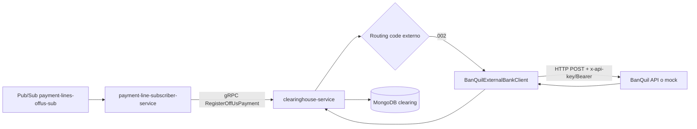

# Anexo X - Clearing con Banco Externo y Secret Manager

## Objetivo

Configurar `clearinghouse-service` para enviar pagos `OFF_US` hacia un banco externo, manteniendo las credenciales fuera del codigo y fuera del `ConfigMap`.

En esta implementacion se usa:

| Elemento | Servicio |
| --- | --- |
| Banco propio | BanQuito |
| Banco externo de prueba | BanQuil |
| Comunicacion interna | gRPC desde `payment-line-subscriber-service` hacia `clearinghouse-service` |
| Comunicacion externa | HTTP desde `clearinghouse-service` hacia BanQuil |
| Credenciales | Google Secret Manager sincronizado como Kubernetes Secret |

## Responsabilidad Arquitectonica

`clearinghouse-service` es el limite entre BanQuito y bancos externos.

Debe hacer:

| Responsabilidad | Estado |
| --- | --- |
| Recibir pagos OFF-US por gRPC interno | Implementado |
| Validar que el routing code sea de un banco externo soportado | Implementado |
| Enviar el pago al endpoint externo correspondiente | Implementado |
| Enviar credenciales en headers seguros | Implementado |
| Registrar respuesta externa | Implementado |

No debe hacer:

| No corresponde a clearing | Responsable correcto |
| --- | --- |
| Validar saldos internos BanQuito | Core / `internal-payment-processor-service` |
| Acreditar cuentas BanQuito ON-US | Core Bancario |
| Clasificar lineas del archivo | `payment-line-classifier-service` |
| Consumir directamente Pub/Sub si ya existe subscriber central | `payment-line-subscriber-service` |

## Flujo



## Variables no Sensibles

Estas variables se mantienen en `ConfigMap` porque no contienen passwords ni tokens:

| Variable | Valor actual de demo | Uso |
| --- | --- | --- |
| `BANQUITO_ROUTING_CODE` | `001` | Codigo propio de BanQuito. No debe enviarse a clearing externo. |
| `BANQUIL_BANK_CODE` | `BANQUIL` | Identificador del banco externo. |
| `BANQUIL_ROUTING_CODES` | `002` | Routing codes que pertenecen a BanQuil. |
| `BANQUIL_ENDPOINT_URL` | `http://clearinghouse-service.banquito-switch.svc.cluster.local:8087/mock/banks/banquil/payments` | Endpoint externo/mock para pruebas. |
| `BANQUIL_API_KEY_HEADER_NAME` | `x-api-key` | Nombre del header usado para API Key. |
| `BANQUIL_TIMEOUT_SECONDS` | `10` | Timeout maximo para llamada externa. |

Archivo actualizado:

```text
banquito-infra/k8s/configmap.yaml
```

Namespace:

```text
banquito-switch
```

## Variables Sensibles

Estas variables deben vivir en Google Secret Manager:

| Secret Manager | Variable Kubernetes | Uso |
| --- | --- | --- |
| `banquil-api-key` | `BANQUIL_API_KEY` | API Key para consumir API externa de BanQuil. |
| `banquil-bearer-token` | `BANQUIL_BEARER_TOKEN` | Bearer token opcional si el banco externo lo exige. |

Nota:

```text
Si BanQuil solo requiere API Key, BANQUIL_BEARER_TOKEN puede quedar vacio.
Si BanQuil usa OAuth2 o token tecnico, se carga en BANQUIL_BEARER_TOKEN.
```

## Comandos para Crear Secretos en Secret Manager

PowerShell:

```powershell
$PROJECT_ID='project-47695a8e-7cb2-4352-af2'

'valor-real-api-key-banquil' | gcloud secrets create banquil-api-key `
  --project=$PROJECT_ID `
  --replication-policy=automatic `
  --data-file=-

'valor-real-token-banquil-o-vacio' | gcloud secrets create banquil-bearer-token `
  --project=$PROJECT_ID `
  --replication-policy=automatic `
  --data-file=-
```

Si el secreto ya existe y solo se va a actualizar:

```powershell
'nuevo-valor-api-key-banquil' | gcloud secrets versions add banquil-api-key `
  --project=$PROJECT_ID `
  --data-file=-

'nuevo-valor-token-banquil-o-vacio' | gcloud secrets versions add banquil-bearer-token `
  --project=$PROJECT_ID `
  --data-file=-
```

## Sincronizar a Kubernetes Secret

El cluster consume las credenciales como variables de entorno desde un Kubernetes Secret llamado:

```text
external-bank-secrets
```

Comando:

```powershell
$PROJECT_ID='project-47695a8e-7cb2-4352-af2'

$BANQUIL_API_KEY = gcloud secrets versions access latest `
  --secret=banquil-api-key `
  --project=$PROJECT_ID

$BANQUIL_BEARER_TOKEN = gcloud secrets versions access latest `
  --secret=banquil-bearer-token `
  --project=$PROJECT_ID

kubectl create secret generic external-bank-secrets `
  -n banquito-switch `
  --from-literal=BANQUIL_API_KEY=$BANQUIL_API_KEY `
  --from-literal=BANQUIL_BEARER_TOKEN=$BANQUIL_BEARER_TOKEN `
  --dry-run=client -o yaml | kubectl apply -f -
```

Verificacion:

```powershell
kubectl get secret external-bank-secrets -n banquito-switch
kubectl describe secret external-bank-secrets -n banquito-switch
```

## Deployment Actualizado

`clearinghouse-service` ahora consume:

| Fuente | Uso |
| --- | --- |
| `banquito-config` | Endpoint, routing codes y timeout no sensible. |
| `mongo-services-secrets` | Conexion MongoDB Atlas. |
| `external-bank-secrets` | API Key y bearer token de banco externo. |

Archivo actualizado:

```text
banquito-infra/k8s/clearinghouse/deployment.yaml
```

Fragmento relevante:

```yaml
envFrom:
  - configMapRef:
      name: banquito-config
  - secretRef:
      name: mongo-services-secrets
  - secretRef:
      name: external-bank-secrets
      optional: true
```

`optional: true` permite correr la demo con mock aun si no se ha cargado la API Key. Para produccion deberia ser obligatorio.

## Cambios Aplicados en Codigo

Repositorio:

```text
banquito-clearinghouse-service
```

Archivos modificados:

| Archivo | Cambio |
| --- | --- |
| `ClearingBankProperties.java` | Agrega `apiKeyHeaderName`, `bearerToken` y `timeoutSeconds`. |
| `BanquilExternalBankClient.java` | Envia API Key configurable, Bearer token opcional y timeout de llamada externa. |
| `application.properties` | Parametriza las nuevas variables desde ambiente. |

Variables soportadas:

```properties
BANQUIL_BANK_CODE
BANQUIL_ROUTING_CODES
BANQUIL_ENDPOINT_URL
BANQUIL_API_KEY_HEADER_NAME
BANQUIL_API_KEY
BANQUIL_BEARER_TOKEN
BANQUIL_TIMEOUT_SECONDS
```

## Comandos para Aplicar en Kubernetes

Desde Windows 11:

```powershell
cd C:\Users\User\Desktop\KUBERNETS-PROYECTO\banquito-infra\k8s

kubectl apply -f .\configmap.yaml
kubectl apply -f .\clearinghouse\deployment.yaml
kubectl rollout restart deployment/clearinghouse-service -n banquito-switch
kubectl rollout status deployment/clearinghouse-service -n banquito-switch --timeout=180s
```

Ver logs:

```powershell
kubectl logs -n banquito-switch deployment/clearinghouse-service --tail=120
```

Ver pod y variables no sensibles:

```powershell
kubectl get pods -n banquito-switch -l app=clearinghouse
kubectl describe deployment clearinghouse-service -n banquito-switch
```

## Validacion Funcional

Para validar una operacion OFF-US:

1. Enviar un lote con una linea cuyo routing code sea `002`.
2. Verificar que `payment-line-classifier-service` la marque como `OFF_US`.
3. Verificar que `payment-line-publisher-service` la publique con:

```text
routingKey=offus
routingClassification=OFF_US
```

4. Verificar que `payment-line-subscriber-service` consuma `payment-lines-offus-sub`.
5. Verificar que `payment-line-subscriber-service` llame por gRPC a:

```text
clearinghouse-service.banquito-switch.svc.cluster.local:9094
```

6. Verificar logs de clearing:

```powershell
kubectl logs -n banquito-switch deployment/clearinghouse-service --since=20m | Select-String "BanQuil|OFF-US|routing|external"
```

## Resultado Esperado

En MongoDB de clearing debe quedar una operacion `OffUsPayment` con:

| Campo | Valor esperado |
| --- | --- |
| `routingCode` | `002` |
| `externalBankCode` | `BANQUIL` |
| `externalStatus` | `ACCEPTED`, `REJECTED` o `PENDING` |
| `externalReference` | Referencia devuelta por BanQuil/mock |
| `status` | `RECEIVED` si el externo acepto, `ERROR` si fallo |

## Frase para Sustentacion

> La conexion con bancos externos esta aislada en `clearinghouse-service`. El resto del Switch no conoce URLs, API Keys ni protocolos de terceros. Las credenciales se almacenan en Google Secret Manager y se inyectan al Pod como Kubernetes Secret. Si mañana cambia BanQuil o se agrega otro banco, se modifica el adaptador de clearing y la configuracion, sin tocar `file-reception`, `classifier`, `publisher`, `subscriber` ni el Core.

